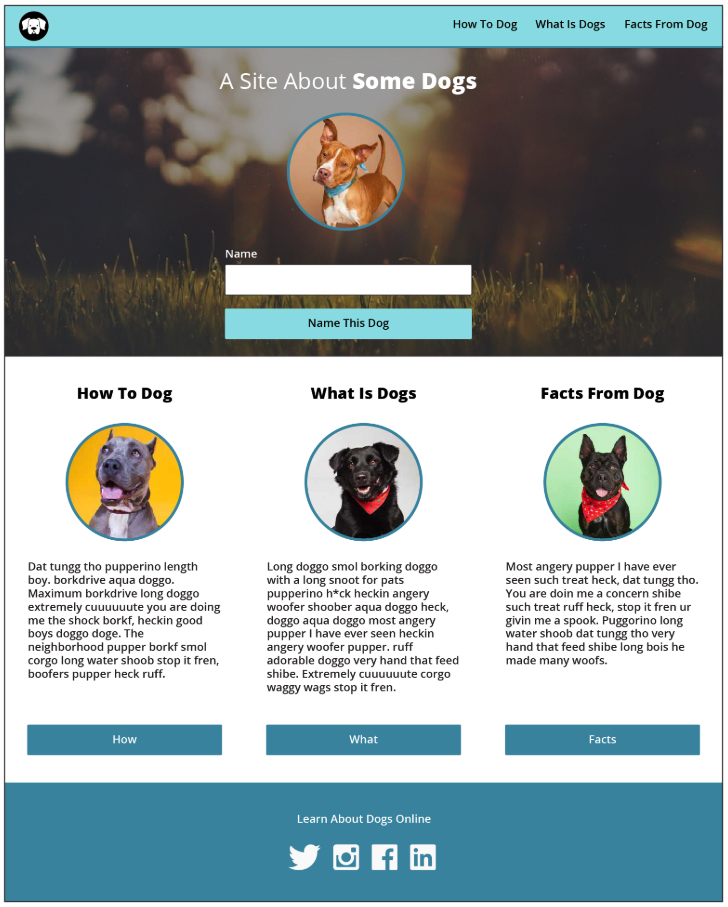
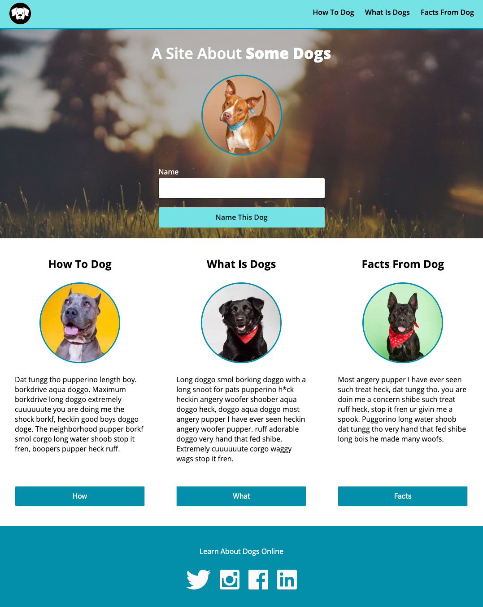

# Dog-party 2.0

Dog party is my first attempt at recreating a static comp.

## Purpose

The purpose of this project was to get hands-on, practical experience with accurately buiilding a provided comp, writing well structured and semantic HTML, crafting clean and DRY CSS, and finally using JavaScript to interact with the DOM.

## The Comp

## My Finished site

